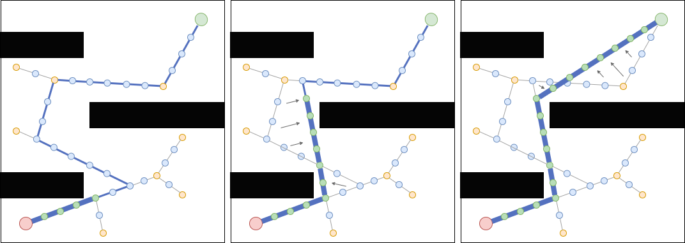
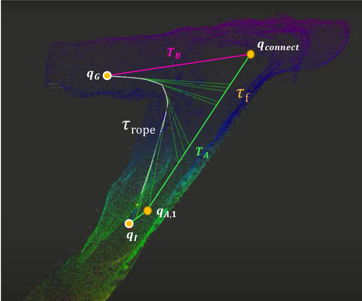

## RRT-Rope: A deterministic shortening approach for fast near-optimal path planning in large-scale uncluttered 3D environments

Many path planning algorithms have been introduced so far, but most are costly, in path cost and in processing time, in large-scale uncluttered 3D environments such as underground mining stopes explored by an unmanned aerial vehicle (UAV). Rapidly-exploring Random Tree (RRT) algorithms are popular because of their probabilistic completeness and rapidity in finding a feasible path in single-query problems. Many of the algorithms (e.g. Informed RRT*, RRT#) developed to improve RRT need considerable time to converge in large environments. Shortcutting an RRT is an old idea that has been proven to outperform RRT variants. This paper introduces a new method, RRT-Rope, that aims at finding a near-optimal solution in a drastically shorter amount of time. The proposed approach benefits from fast computation of a feasible path with an altered version of RRT-connect, and post-processes it quickly with a deterministic shortcutting technique, taking advantage of intermediate nodes added to each branch of the tree. This paper presents simulations and statistics carried out to show the efficiency of RRT-Rope, which gives better results in terms of path cost and computation time than other popular RRT variations and shortening techniques in all our simulation environments, and is up to 70% faster than the next best algorithm in a representative stope.

A video showing functionalities of RRT-Rope is available [here](https://www.youtube.com/watch?v=zd54WoifAIk&ab_channel=LouisPetit). 

<p align="center">
  
</p>

Demo available [here](https://www.edu.louispetit.be/demo/rrt-rope-demo). More info [here](https://www.edu.louispetit.be/rrt-rope)

<p align="center">
  
</p>

This repository contains only the code for the HTML demo in 2D. For use in robotics applications or other planning pipelines, the RRT-Rope algorithm is available directly in the [Open Motion Planning Library (OMPL)](https://ompl.kavrakilab.org/index.html). It is implemented as the ropeShortcutPath function, documented [here](https://ompl.kavrakilab.org/classompl_1_1geometric_1_1PathSimplifier.html#a769875a6b05a77835ff0eaa2e948a221). Below is a minimal example of how to use it:

```
#include <ompl/geometric/planners/rrt/RRTConnect.h>
#include <ompl/geometric/PathGeometric.h>

// Assuming 'planner' is an instance of ompl::geometric::RRTConnect
getPlanner()->as<ompl::geometric::RRTConnect>()->setProblemDefinition(getProblemDefinition());

// Attempt to solve the problem within a given planning time
ompl::base::PlannerStatus solved = planner_->solve(1.0);

// Get the solution path
auto *sln = static_cast<ompl::geometric::PathGeometric*>(getProblemDefinition()->getSolutionPath().get());

// Perform Rope Shortcut
getPathSimplifier()->ropeShortcutPath(*sln);
```

## Reference

- L. Petit, and A. Desbiens. RRT-Rope: A deterministic shortening approach for fast near-optimal path planning in large-scale uncluttered 3D environments. IEEE International Conference on Systems, Man, and Cybernetics (SMC). Melbourne, Australia, 2021. **Best Student Paper Award** and **Top 5 Best Paper** 

## Author

[Louis Petit](https://edu.louispetit.be) (louis.petit@usherbrooke.ca)
